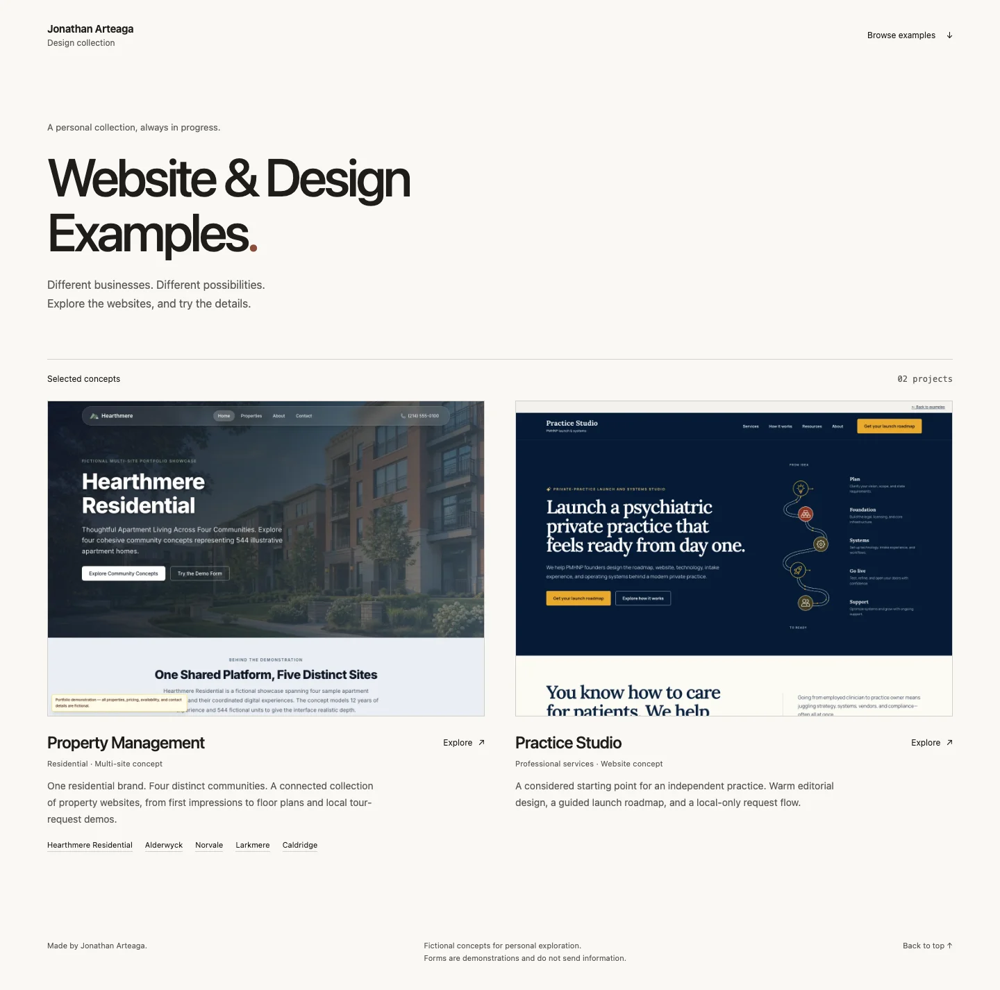

<h1 align="center">Website &amp; Design Examples</h1>
<p align="center">A personal collection of fictional websites by Jonathan Arteaga.</p>
<p align="center"><a href="#examples">Examples</a> · <a href="#how-to-use">How to use</a> · <a href="#adding-an-example">Adding an example</a> · <a href="#license">License</a></p>



## Examples

Two concepts, six individual website experiences. Each retains its own visual identity and framework, while a single static build publishes the collection.

| Concept | Explore |
| --- | --- |
| Property Management | Hearthmere Residential and four connected community sites: Alderwyck, Norvale, Larkmere, and Caldridge |
| Practice Studio | An editorial website and local roadmap-request demonstration |

The gallery is at `/`. Demos live under `/examples/property-management/` and `/examples/practice-studio/`.

All identities and operating details are fictional. Forms do not transmit information. The demos are non-indexable; the gallery is indexable. This is a personal, non-commercial collection, not a live property or healthcare service.

## How to use

Use Node.js 22 and pnpm 11.9.0. Repository access is required.

```bash
git clone https://github.com/jonathan-arteaga/website-examples.git
cd website-examples
pnpm install --frozen-lockfile
pnpm build
pnpm preview
```

Open http://127.0.0.1:3000. The preview serves the assembled static files with the same routing and security-header configuration used for deployment.

For a complete check, install Chromium with `pnpm exec playwright install chromium`, then run `pnpm verify`.

| Command | Purpose |
| --- | --- |
| `pnpm dev` | Gallery development at port 3001 |
| `pnpm dev:hearthmere-residential` | Property app development at port 3000, under its URL prefix |
| `pnpm dev:practice-studio` | Standalone Practice Studio development |
| `pnpm build` | Build the apps and assemble `.vercel/output` |
| `pnpm screenshots` | Refresh gallery screenshots from the running assembled preview |
| `pnpm verify` | Lint, types, build, media/privacy checks, contracts, Sites packaging, and browser tests |

Run one development server at a time when ports overlap. Rebuild after updating screenshots.

## Adding an example

Add an application workspace and one entry to `examples.json`. Each example owns its build and design; no shared theme is required. Follow [Adding examples](docs/adding-examples.md).

See [Deployment](docs/deployment.md) for CI setup and [Migration](docs/migration.md) for imported histories and legacy URLs. Resource checks enforce a 100 MiB static artifact budget and Vercel's route limit; no functions or runtime image optimizer are generated.

## License

The original [MIT license](LICENSE) and [Practice Studio MIT license](apps/practice-studio/LICENSE) are retained. Third-party assets and dependencies retain their respective terms; importing these projects does not broaden those rights. The source repository remains private.
