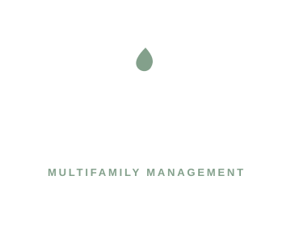

<h1 align="center">
  <br>
  <a href="https://hearthmere-residential.vercel.app"></a>
  <br>
  Hearthmere Residential
</h1>

<h4 align="center">A fictional property-management showcase: one Next.js app, five path-mounted sites.</h4>

<p align="center">
  <a href="https://github.com/jonathan-arteaga/property-management/actions/workflows/ci.yml"></a>
  <a href="https://github.com/jonathan-arteaga/property-management/actions/workflows/security-secrets.yml"></a>
  <a href="https://github.com/jonathan-arteaga/property-management/actions/workflows/security-dependencies.yml"></a>
</p>

<p align="center">
  <a href="LICENSE"></a>
</p>

<p align="center">
  <a href="#features">Features</a> •
  <a href="#how-to-use">How To Use</a> •
  <a href="#resources">Resources</a> •
  <a href="#license">License</a>
</p>

## Features

This is a public-facing fictional property-management showcase with a private source repository. Every name, address, phone number, price, point of interest, image, and operating detail is invented for the showcase.

The sites are not live leasing properties. Forms, applications, tour requests, resident tools, availability, prices, mobility scores, and neighborhood distances are demonstration experiences only. Local fallback URLs use the reserved `.example` domain.

| Site | Fictional location | Phone | Homes |
| --- | --- | --- | ---: |
| Hearthmere Residential | 100 Portfolio Way, Suite 400, Example City, TX 00000 | (214) 555-0100 | 544 across 4 communities |
| Alderwyck Apartments | 1420 Lantern Walk, Example City, TX 00000 | (682) 555-0111 | 148 |
| Norvale Commons | 2875 Juniper Loop, Sample City, TN 00000 | (615) 555-0122 | 112 |
| Larkmere Gardens | 3640 Garden Terrace, Demo City, KS 00000 | (785) 555-0133 | 128 |
| Caldridge Townhomes | 4812 Foundry Row, Example Heights, TN 00000 | (423) 555-0144 | 156 |

- **One origin** — corporate `/` plus `/alderwyck`, `/norvale`, `/larkmere`, `/caldridge`.
- **Demo-hardened CSP** — forms succeed locally with zero off-origin posts.
- **Sitewide noindex** — `X-Robots-Tag` and `robots.ts` disallow `/`.
- **Privacy gate** — hashed scan for real-client words before merge.

## How To Use

You will need Node.js 22 or newer and pnpm 11.9.0. From your command line:

```bash
# Clone this repository
git clone https://github.com/jonathan-arteaga/property-management.git

# Go into the repository
cd property-management

# Install dependencies
pnpm install

# Install Playwright Chromium for verify
pnpm exec playwright install chromium

# Run the showcase
pnpm dev

# Lint, type-check, build, media/privacy gates, tests, and e2e
pnpm verify
```

Open [http://127.0.0.1:3000](http://127.0.0.1:3000). `pnpm dev:hearthmere-residential` runs the consolidated showcase directly.

`pnpm verify` runs lint, type-check, the consolidated production build, strict media and privacy gates, Node contract tests, and the 197-case Playwright suite.

<details>
<summary>Production environment</summary>

One Vercel project serves all five showcase experiences:

| Experience | Public path |
| --- | --- |
| Hearthmere Residential | `/` |
| Alderwyck Apartments | `/alderwyck` |
| Norvale Commons | `/norvale` |
| Larkmere Gardens | `/larkmere` |
| Caldridge Townhomes | `/caldridge` |

Configure the `hearthmere-residential` project with `NEXT_PUBLIC_SITE_URL=https://hearthmere-residential.vercel.app`. The single Next.js build uses separate root layouts to preserve each site design while sharing one origin, asset pipeline, image optimizer, CSP, robots policy, and Vercel deployment.

Optional local validation:

```bash
pnpm install --frozen-lockfile
pnpm images:audit --strict
pnpm audit --audit-level=high --prod
```

</details>

## Resources

- **[Live showcase](https://hearthmere-residential.vercel.app)**

## License

MIT — see [LICENSE](LICENSE) for details.

---

> [hearthmere-residential.vercel.app](https://hearthmere-residential.vercel.app) · GitHub [@jonathan-arteaga](https://github.com/jonathan-arteaga)
