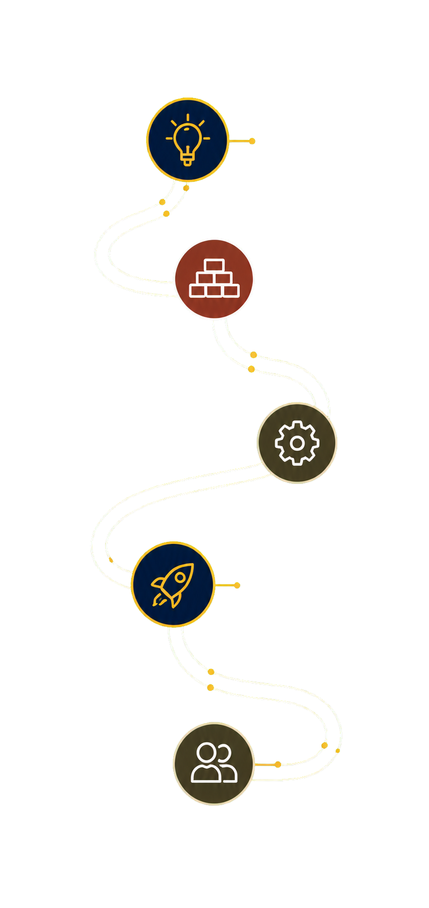

<h1 align="center">
  Practice Studio
</h1>

<h4 align="center">A Vite homepage prototype for a PMHNP private-practice launch and systems consultancy.</h4>

<p align="center">
  <a href="LICENSE"></a>
</p>

<p align="center">
  <a href="#features">Features</a> •
  <a href="#how-to-use">How To Use</a> •
  <a href="#resources">Resources</a> •
  <a href="#license">License</a>
</p>



## Features

The site combines a warm, structured launch roadmap with an editorial dark-navy hero. It includes responsive navigation, a mobile menu, and a working local prototype of the launch-roadmap request flow.

- **Roadmap dialog** — focus trap, Escape, restore focus, required name/email/state/timing.
- **Local-only form** — submit does not transmit or persist information.
- **Consulting disclaimer** — "do not include patient information" in the footer.
- **Sites worker** — `pnpm --filter practice-studio build` packages an OpenAI Sites SPA fallback worker.

## How To Use

Use Node 22 and pnpm 11.9.0 from the monorepo root. From your command line:

```bash
# Clone this repository
git clone https://github.com/jonathan-arteaga/website-examples.git

# Go into the repository
cd website-examples

# Install dependencies
pnpm install --frozen-lockfile

# Run the prototype
pnpm --filter practice-studio dev

# Production build (includes Sites worker)
pnpm --filter practice-studio build

# Sites worker tests
pnpm --filter practice-studio test:sites
```

The roadmap form is intentionally local-only. It does not transmit or persist submitted information.

## Resources

- **[Preview deployment](https://website-examples-alpha.vercel.app/examples/practice-studio/)**

## License

MIT — see [LICENSE](LICENSE) for details.

---

> GitHub [@jonathan-arteaga](https://github.com/jonathan-arteaga)
